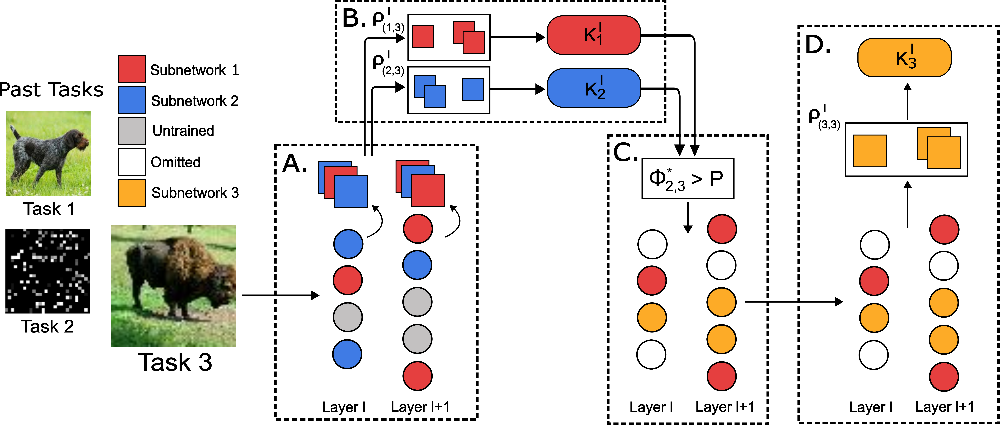
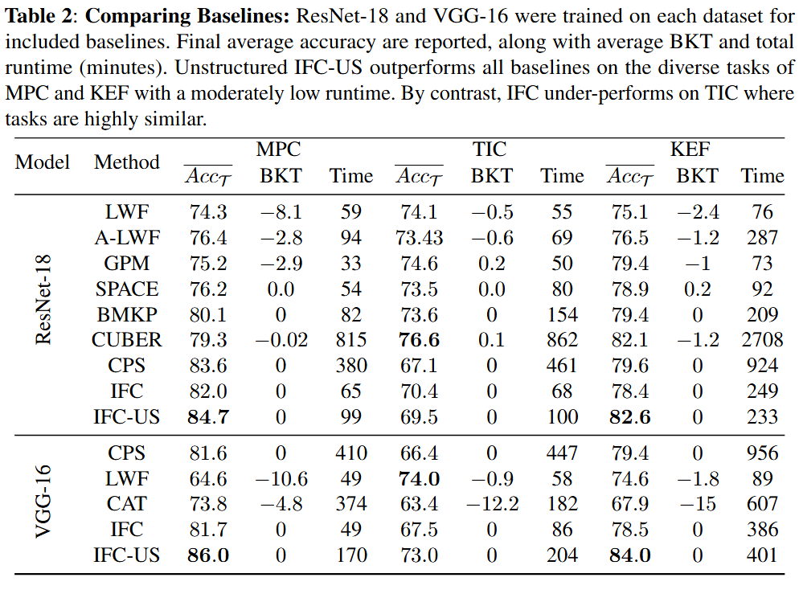

# Information Flow Clustering for Continual Learning
Clustering and sharing of useful past tasks in Continual Learning via Information Flow metrics

This repository provides the code for implementing Information Flow Clustering in the Continual Learning (CL) setting.
The aim of this code is to facilitate the investigation of weight sharing in CL. In particular, how we may identify and share 
the best subset of past tasks' weights when training a subnetwork for the current task. This additionally allows us to provide insights into 
how different sharing decisions may influence the forward knowledge transfer between CL tasks in order to improve overall accuracy.

# Method Summary

Information Flow Clustering (IFC) provides a method for determining which previously trained subnetworks are useful when shared with the currently trained task. For each task *t*, a new subnetwork *S_t* is trained, consisting of a partition of weights dedicated to task *t*. One or more previously trained and frozen subnetworks may be unmasked during the training of task *t* to share past knowledge with subnetwork *S_t* during the training. IFC implements K-Means models for each previous subnetwork, fit using their behavior on the data for which they were trained. 

After training on a given task *t* finishes, the behavior of subnetwork *S_t* is measured for task *t* by collecting the Pearson Correlation of activations between subsequent pairs of layer outputs. The values are used to fit K-means models *K_t,l* for each layer. When beginning training on a new task *t'>t*, we collect the activations for each previously frozen subnetwork for data from task *t'* and compare these to the K-Means models fit for the data they were initially trained for. Subnetworks with low K-Means scored on task *t'* are deemed to be useful for the task, as their behavior is similar to the task for which they were optimized. A threshold on K-Means score is set and all subnetworks whose behavior falls within this threshold are shared for the training of the new task *t'*.

# Usage
Prior to running the code, if you do not already have Tiny Imagenet, K49 MNIST, EMNIST, or Fashion MNIST set up, the provided "Tiny_ImageNet_200_Setup.ipynb" and "KEF_MNIST_Datasets_Preparation.ipynb" notebooks can be used to prepare them. The raw datasets can also be obtained from the following sources:
KMNIST 49 - https://github.com/rois-codh/kmnist
EMNIST - https://www.nist.gov/itl/products-and-services/emnist-dataset
Fashion MNIST - github.com/zalandoresearch/fashion-mnist/tree/master/data/fashion

Once the data has been prepared and placed in the data/ directory, the model can be trained using the "Example_Experiment_Scripts.ipynb" to replicate the core experiments used in the paper for IFC and IFC-US.

# Results

IFC is compared on three custom datasets: Mixed PMNIST-CIFAR (MPC), Tiny Imagenet CIFAR (TIC), and KMNIST EMNIST Fashion MNIST (KEF). IFC-US outperforms other methods on MPC and KEF datasets, while underperforming on TIC. This reflects the benefit of IFC on heterogenous datasets such as MPC and KEF which are designed to have substantially different tasks drawn from MNIST and CIFAR, rather than more homogeneous datasets such as TIC, which is composed entirely of natural images. These results reflect a tradeoff in this method where partitioning the network into subnetworks constrains capacity for each task. For heterogeneous datasets, this constraint is outweighed by the benefit of preventing sharing between substantially different tasks, but when all tasks are relatively similar as in TIC, then there is little benefit to offset this constraint. As a result we propose the use of IFC primarily in cases where tasks are expected to be varied. Revisions are being made to reduce the detriment on homogeneous datasets to bring IFC into line with other methods.

# Directories
.ipynb Files:
	 The provided .ipynb file contains sample code for running the Two-Task and Six-Task experiments from the paper as well as setting up Tiny Imagenet.

Experiment Scripts:
	Main.py: Directs the sequential training of a network on a series of tasks. Used to train all experiments
	Eval Two Task Experiments:   Can collect a dictionary of all connectivitiesd or activations for a two-task experiment, and/or evaluate accuracy

Auxiliary Scripts:
	Manager.py: Manager is the primary class which orchestrates pruning, training, and weight sharing of the model
	Network.py: A class which holds the model and performs operations on the model such as switching out the classifier for each task or masking operations
	clmodels.py: Defines the VGG16 and Modified ResNet-18 networks used in this work
	cldatasets.py: Loads the necessary datasets. Includes the setup code for the MPC dataset (TIC setup requires an accompanying ipynb notebook).
	DataGenerator.py: A simple data generator for pytorch
	Utils.py: Performs miscellaneous functions including mask operations and activation collections.
	Hsic_estimator.py: The CKA estimator implemented for supplementary material experiments

The directory layout is as follows:
Note: Output and data directories are generated when first run
 - Relative Root
 	- data
 		- <Datasets>
 	- checkpoints
 		- <Saved model checkpoints from training>
 	- src
 		- logs
 			- <text outputs from experiment runtime>
 		- Scripts and .ipynb files for running experiments
 		- AuxiliaryScripts
 			- <Required Python scripts for experiments>
